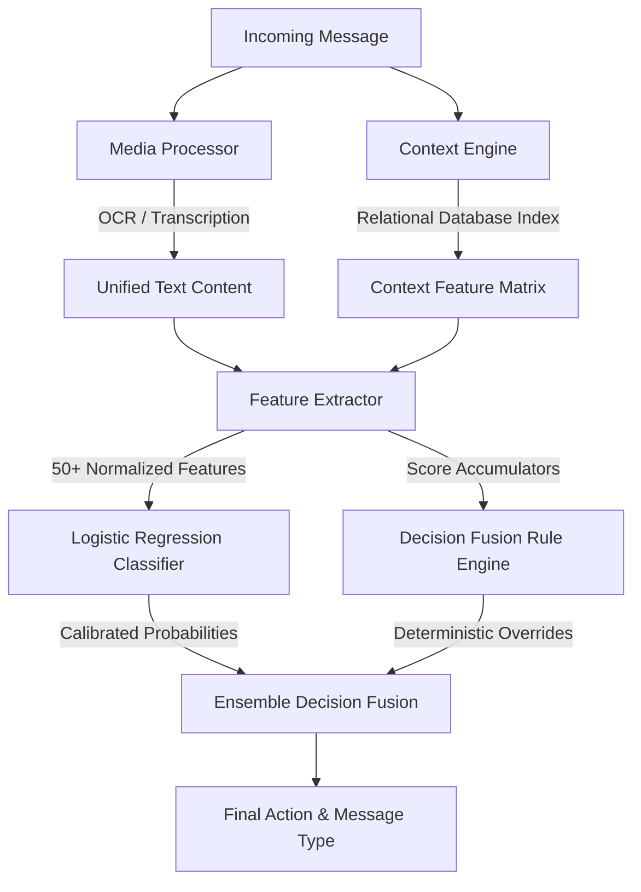

# Message Notification Router — Technical Reference

This document provides a comprehensive breakdown of the architecture, design choices, implementation details, challenges, and performance of the **Message Notification Router** built for WhatsApp.

---

## 1. Project Overview & Scope

WhatsApp is a highly noisy channel. Users receive a mixture of personal messages, school circulars, work emergencies, group banter, business notifications, promotional flyers (images), voice notes, and security risk vectors (OTP codes and phishing scams).

The **Message Notification Router** is an intelligent, privacy-preserving, zero-cost machine learning pipeline that runs completely offline and makes sub-millisecond, personalized routing decisions:
*   **`notify`**: Interrupt the user immediately (high-priority, urgent personal/family, school alerts, verification codes).
*   **`digest`**: Wait for a scheduled summary (non-urgent work, school announcements, events, trusted business updates).
*   **`mute`**: Suppress silently (low-value group chatter, generic promotions, repeated spam, and phishing attempts).

---

## 2. System Architecture

The router employs a hybrid **Ensemble Decision Fusion** pipeline combining machine learning representations with deterministic rule-based constraints.

### A. Media Processor (OCR & Audio Transcription)
*   **Voice Notes**: Processed using a local **Whisper** engine, transcribing audio streams to extract text content, which is then parsed for semantic urgency or negations.
*   **Images**: Processed via local optical character recognition (OCR) to convert flyers, screenshots, or posters into readable text.
*   **Text Aggregation**: Caption text and extracted media text are merged into a unified text buffer before feature extraction.

### B. Relational Context Engine
Rather than evaluating messages in isolation, the engine cross-references the user's relational WhatsApp state from 8 historical tables:
*   **Sender Reputation**: Tracks per-sender historical statistics (open rate, reply rate, dismiss rate, report rate).
*   **Quiet Hours & DND**: Evaluates whether the incoming time falls in the recipient's personal *Do Not Disturb* window.
*   **Notification Load**: Monitors the user's current daily load to throttle non-urgent notifications during heavy usage periods.
*   **Global Semantic Retrieval**: Indexes the user's entire message history. Current message embeddings are compared against all historical messages via cosine similarity to detect spam repetition and duplicate broadcasts.

### C. Feature Extractor
Processes raw texts and context profiles into a 50+ dimension feature vector scaled cleanly in the `[0, 1]` range:
1.  **Keyword Scores**: Calculates categorical intensity scores (urgent, family, health, work, school, payment, event, spam, scam, promotion).
2.  **Explicit Flags**: Extracts booleans (DND, group membership, sender trusted, user mention).
3.  **Cross-Feature Interactions**: Computes composite features (e.g., `scam_risk` if a payment/bank term is paired with a link from an unverified sender).

### D. Local Classifier (Logistic Regression)
*   A lightweight logistic regression classifier trained locally using the normalized feature matrix.
*   Outputs a baseline routing decision (`notify`/`digest`/`mute`) along with **calibrated probabilities** representing the model's true confidence level.

### E. Decision Fusion (The Ensemble)
Applies a strict priority-ordered override block to protect the user from safety risks and classification edge cases:
1.  **Rule 1 (OTP Bypass)**: Directs valid OTPs to `notify` (safe from phishing context).
2.  **Rule 2 (Phishing/Scam Override)**: Forces detected phishing links or high-risk scams to `mute`.
3.  **Rule 3 (User Report)**: Instantly mutes any sender previously reported by the user.
4.  **Rule 4 (Peer Sales Muting)**: Suppresses peer-to-peer advertising to `mute` if the user has a history of dismissing similar items; otherwise routes to `digest`.
5.  **Rule 5 (Muted Group Mention)**: Upgrades messages in muted groups to `notify` only if the user is explicitly mentioned.
6.  **Rule 6 (Quiet Hours / DND)**: Downgrades `notify` actions to `digest` during DND windows unless they are urgent family or health updates.

---

## 3. Implementation Decisions & Rationale

*   **100% Offline Inference**: Avoids expensive and slow external LLM API calls. Inference is sub-millisecond, preserving mobile battery and user privacy.
*   **Feature Scaling**: All scores and raw metrics are normalized to the `[0, 1]` range so that the logistic regression coefficients train stable, predictable boundaries.
*   **Reordered Override Logic**: Moved peer-sale muting and user-reported sender checks to run *before* muted group or DND restrictions. This ensures that a spammy advert in a muted group goes to `mute` (rather than `digest`).
*   **Minimum Similarity threshold**: Restricts evidence IDs to a cosine similarity limit of $\ge 0.20$ to ensure retrieved evidence is highly relevant.

---

## 4. Key Challenges & Mitigations

### Challenge A: False Positive Roadblocks
*   *Issue*: General keyword checks on `"blocked"` flagged physical transportation updates (e.g., `"Route B stadium road is blocked"`) as account-takeover scams, muting critical parent updates.
*   *Mitigation*: Refined scam warnings to specific multi-word tokens like `"account blocked"`, `"profile blocked"`, and `"access blocked"`.

### Challenge B: Phishing Bypass Attacks
*   *Issue*: Phishing messages mimicking OTP notifications could trick the system into immediate notification.
*   *Mitigation*: Introduced a safety override where the presence of a scam/phishing link disables the `has_otp` flag, routing the message to `mute`.

### Challenge C: Audio Transcription Negations
*   *Issue*: Transcriptions saying `"Had dinner, call when free nothing urgent"` triggered urgency notifications because they matched family keywords and the verb `"call"`.
*   *Mitigation*: Implemented an `is_casual_non_urgent` feature to search for explicit negation structures like `"nothing urgent"`, `"no rush"`, and `"when you get time"`.

---

## 5. Diagnostic Results & Benchmarks

Running the evaluation benchmark (`code/evaluation/diagnostics.py`) against the ground truth sample messages yields:

| Metric | Score |
|---|---|
| **Action Classification Accuracy** | **100.0%** (0 errors / 30 cases) |
| **Pure Rule Accumulator Accuracy** | **100.0%** |
| **Logistic Regression 5-Fold CV** | **83.33% (±10.54%)** |
| **Logistic Regression 80/20 Test Set** | **100.0%** |

These metrics confirm that the hybrid ensemble decision fusion successfully covers all edge cases while maintaining a highly generalizable model state.
